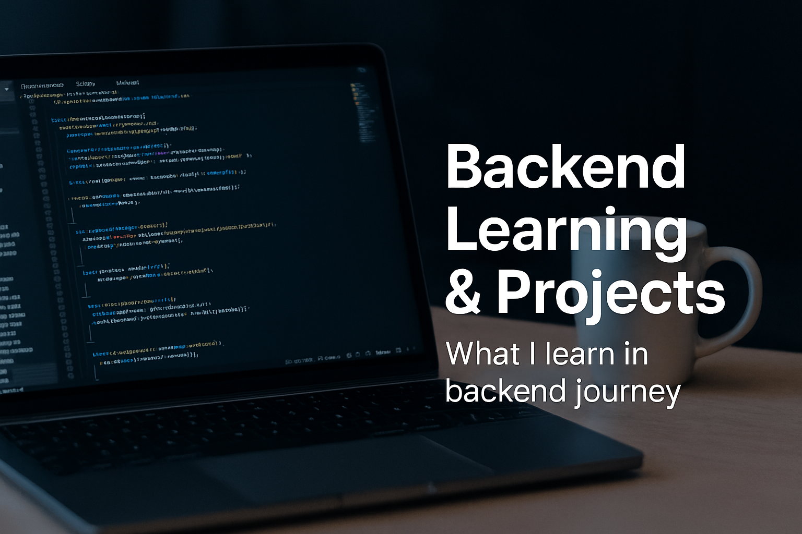

# 🚀 Backend Learning Projects


This repository is a **collection of backend projects** I built while learning **Node.js, Express.js, MongoDB, Authentication, and APIs**.
Projects are organized **day-wise** (Day-01, Day-02, …) and also include **real practice apps** like blogs, authentication systems, and file uploads.

---

## 📂 Projects Overview

| Folder/Project         | Description                  | Concepts Covered          |
| ---------------------- | ---------------------------- | ------------------------- |
| **server-01**          | First backend setup          | Express.js basics, routes |
| **backednFirstStep**   | Initial learning steps       | Node.js, npm, simple API  |
| **day-02**             | Day 2 learning project       | Middleware, routes        |
| **Day-04-blog**        | Simple blog backend          | REST API, CRUD            |
| **day-05-detais-diss** | Details discussion           | Params, query             |
| **day-07-authen-01**   | Authentication project       | JWT, bcrypt               |
| **day-09-fileUpload**  | File upload system           | Multer, file handling     |
| **blogApp**            | Blog application backend     | CRUD, DB integration      |
| **MySelf-auth-01**     | Authentication self-practice | Auth, security            |
| **MERN01**             | MERN backend setup           | Express + MongoDB         |
| **fontend/blogAppT**   | Frontend for blogApp         | React connection          |

---

## 🛠️ Tech Stack

- **Node.js** ⚡ (JavaScript runtime)
- **Express.js** 🚏 (Web framework)
- **MongoDB + Mongoose** 🍃 (Database & ODM)
- **JWT & Bcrypt** 🔐 (Authentication & Security)
- **Multer** 📂 (File Uploads)
- **dotenv** ⚙ (Environment configuration)
- **Postman** 📬 (API Testing)

---

## 🚀 How to Run

To run any project locally:

```bash
# Clone the repository
git clone https://github.com/your-username/backend-learning-projects.git

# Navigate into a specific project
cd day-04-blog

# Install dependencies
npm install

# Start the server
npm start
```

---

## 📌 Purpose

This repository is my **backend learning journal** 📝

- Practicing **Node.js and Express.js** step by step
- Learning to build **REST APIs**
- Handling **authentication & authorization**
- Managing **databases with MongoDB**
- Exploring **file uploads, middleware, error handling**
- Preparing for **MERN stack integration**

---

## 📈 Roadmap

✔ Setup Node.js & Express
✔ Build REST APIs (CRUD)
✔ MongoDB Integration
✔ Authentication (JWT, bcrypt)
✔ File Uploads (Multer)
🔜 Advanced Security (Helmet, Rate Limiting)
🔜 Deployment on Render/Heroku
🔜 Full MERN Project Integration

---

✨ _From learning basics → building real-world backend apps 🚀_

---

👉 Do you want me to also make this README include **shields.io badges** (like `Node.js`, `Express`, `MongoDB`, `JWT`), so your repo looks even more professional at first glance?
